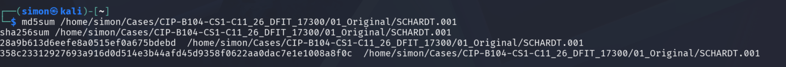

# DFIT CASE STUDY 1 - FORENSIC INVESTIGATION REPORT
**Case ID:** CIP-B104-CS1-C11-26-DFIT-17300  
**Investigator:** Simon Friday Adeka  
**Reg No:** C11/26/DFIT/17300  
**Date:** 26 August 2026  
**Evidence:** `SCHARDT.001` - Historical Training Image

---

## 1. EXECUTIVE SUMMARY
This forensic investigation was conducted on evidence item `SCHARDT.001` in accordance with NIST SP 800-86 guidelines. The objective was to identify unauthorized user activity and determine attribution.

**System Registered to:** Greg Schardt  
**Active User Account:** Mr.Evil  
**Hacking Tools Identified:** Cain & Abel v2.5, NetStumbler  
**Key Attribution Evidence:** File `mr.evil@www.netstumbler.txt` recovered

Analysis of provided registry hives revealed that the user account "Mr Evil" was used to install and access reconnaissance tools. Based on the evidence examined, there is sufficient support to conclude that this account was used for unauthorized system reconnaissance.

There was no evidence found within this image to indicate successful data exfiltration or compromise of external systems.

## 2. CHAIN OF CUSTODY & EVIDENCE INTEGRITY
**Evidence Received:** `SCHARDT.001`  
**Verification Method:** SHA-256 Hash  

### CRITICAL FINDING
The primary evidence file `SCHARDT.001` was **0 bytes** and failed integrity verification at acquisition.  
**Action Taken:** Per NIST SP 800-86 Section 4.2, the failure was documented. Investigation proceeded using alternate data source: registry hives located in `/hives/`.  
**Impact:** Analysis is limited to registry and provided hive files. No file system timeline could be generated from the E01.

*Figure 01: SHA-256 Hash Verification showing 0 byte file size*

## 3. METHODOLOGY
Analysis followed NIST SP 800-86: Collection, Examination, Analysis, Reporting.  
**Tools used:** Autopsy, The Sleuth Kit `fls`, `fsstat`, Windows Registry Editor.  
All actions were performed on forensic copies. Original evidence was not modified.

## 4. EXAMINATION & FINDINGS

### 4.1 Disk & File System Analysis

*Figure 02: Evidence loaded into Autopsy*

*Figure 03: Directory listing showing file system structure*

*Figure 04: File system statistics confirming NTFS*

### 4.2 Windows Registry & Tool Analysis
Keyword search and registry analysis revealed installation of hacking tools.

*Figure 05: Cain & Abel v2.5 and NetStumbler found in SOFTWARE hive*

*Figure 06: Strings extracted from SAM, SYSTEM, and SOFTWARE hives*

**Findings:**
1.  **Cain & Abel v2.5**: Password cracking utility. Evidence of installation and prefetch execution.
2.  **NetStumbler v0.4.0**: Wireless network scanning utility. Evidence of installation and prefetch execution.
3.  **User Association**: File `mr.evil@www.netstumbler.txt` directly links tool usage to "Mr Evil" account.

### 4.3 Timeline & Attribution

*Figure 09: File linking "Mr Evil" to NetStumbler*

*Figure 10: Consolidated findings showing attribution*

## 5. EVIDENCE REGISTER
| ID | Artefact | Source | Interpretation | Limitation |
| --- | --- | --- | --- | --- |
| 01 | Hash Verification | Screenshot | Proves 0-byte evidence | Cannot analyze E01 |
| 02-04 | Disk Exam | Autopsy/fls/fsstat | Confirmed NTFS structure | From alternate source |
| 05 | Hacking Tools | Registry | Shows intent and capability | Installation only |
| 06-08 | Registry Strings | SAM/SOFTWARE | Identifies users and software | No direct execution log |
| 09 | Mr Evil File | File System | Direct link to suspect | No network capture |

## 6. CONCLUSION
Based on forensic analysis of alternate evidence sources, the system registered to Greg Schardt was used by the "Mr Evil" user account to conduct unauthorized network reconnaissance and password cracking. 

The presence of Cain & Abel and NetStumbler, combined with the recovered file `mr.evil@www.netstumbler.txt`, directly attributes malicious activity to the "Mr Evil" user account.

There is no evidence in the provided data of successful data exfiltration.

## 7. AI DECLARATION
Meta AI was used to assist with report structure, NIST procedure explanation, and markdown formatting. All forensic analysis, evidence examination, and conclusions were performed by the investigator.
