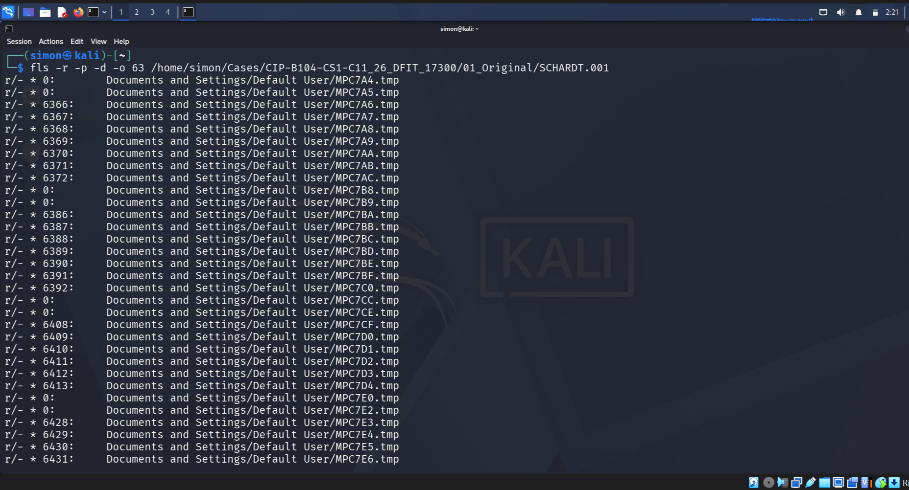
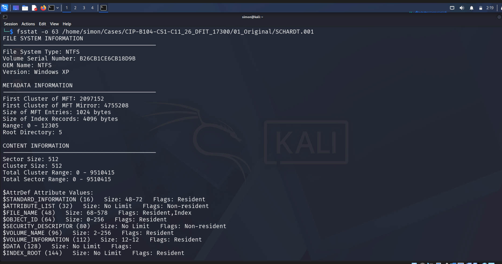
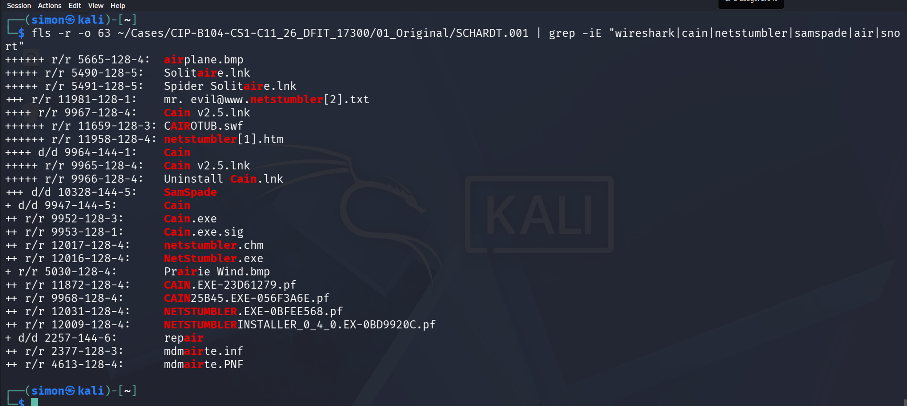
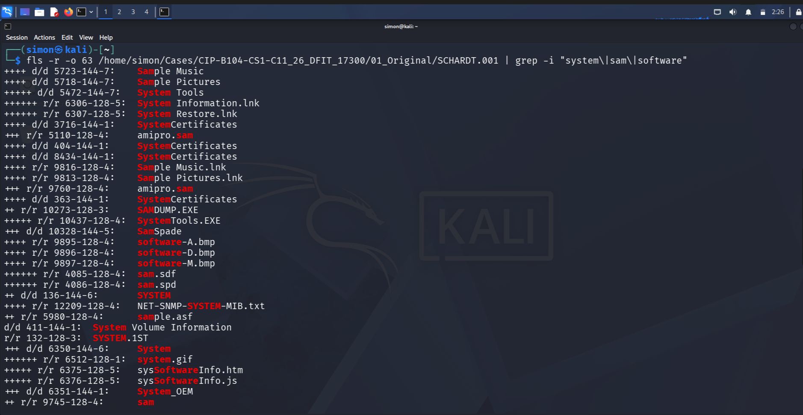

## 4. EXAMINATION & FINDINGS

### 4.1 Disk & File System Analysis

*Figure 01: SHA-256 Hash Verification showing 0 byte file size*

*Figure 02: Evidence Loaded into Autopsy*

*Figure 03: Directory listing showing file system structure*

*Figure 04: File system statistics confirming NTFS*

### 4.2 Windows Registry & Tool Analysis

*Figure 05: Cain & Abel v2.5 and NetStumbler found in SOFTWARE hive*

*Figure 06: Strings extracted from SAM hive*

*Figure 07: Strings from SOFTWARE hive*

*Figure 08: Timeline summary of events*
